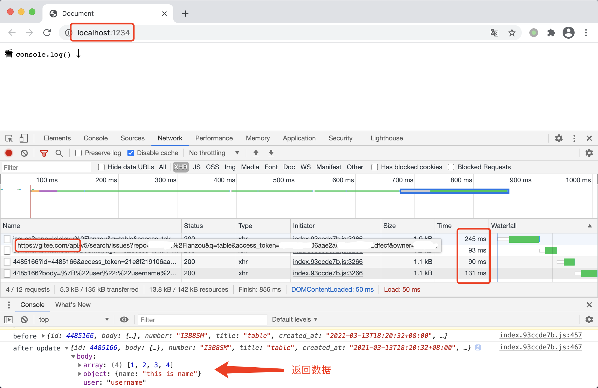

# `gitee-db` 数据库

白嫖数据库功能😏，实现了增、删、改、查功能。有了它，就可让静态页面拥有动态交互功能，从此免去服务器的费用💰。使用码云的 OpenAPI 实现，可跨域，响应速度一级棒😏。

使用 ts 编写，同时支持 `web`、`node`、`react-native`，有完整的接口入参/出参类型提示，enjoy it !

## 预览



## 用法

安装: `yarn add https://github.com/chenhb23/gitee-db.git`

使用前先用 `registry` 注册，`registry` 信息获取途径：

1. 在 `gitee` 新建一个仓库（最好设置为私有仓库，防止他人随意提 issue）
2. 获取 `私人令牌`，获取路径：`设置 -> 私人令牌 -> 生成新令牌`

```ts
import {registry, DB} from 'gitee-db'

registry({
  access_token: 'your owner access_token', // 私人令牌
  owner: 'your owner name', // 用户名
  repo: 'your repo name',  // 仓库名
})

;(async () => {
  const db = new DB()
  // 获取 table 对象
  const table = await db.table('tableName')
  // 查询第一条数据
  const data = await table.findOne()

  const info = {
    user: 'username',
    array: [1, 3, 4],
    object: {name: 'this is name'},
  }
  console.log('before', data)
  if (data) {
    const dto = await table.update(data.id, info)
    console.log('after update', dto)
  } else {
    const dto = await table.insert(info)
    console.log('after insert', dto)
  }
})()
```

## Api

- `findOne<T>(id?: string): Promise<DTO<T>>`


- `findMany<T>(options?: {limit?: number; startPage?: number}): Promise<{cur_page: number; list: DTO<T>[]}>`


- `insert<T>(body: T): Promise<DTO<T>>`


- `update<T>(id: string, body: Partial<T>, options?: {replace: boolean}): Promise<DTO<T>>`


- `delete(id: string): AxiosPromise<any>;`


- `where<T>(filter: (value: DTO<T>) => boolean)`。where 之后只能使用 findOne 和 findMany
